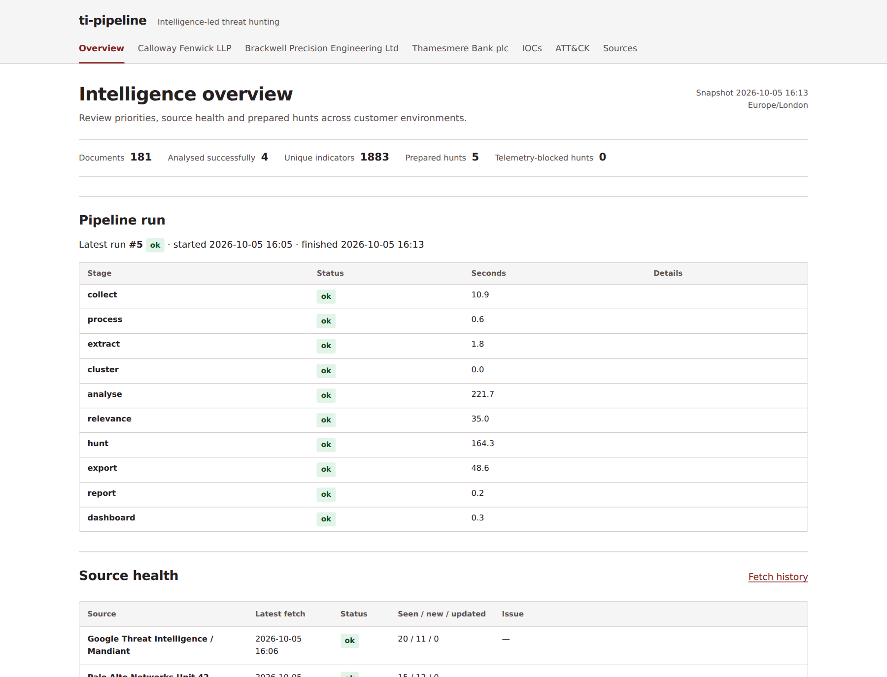

# ti-pipeline

I work in a SOC, and most of the threat intelligence I see arrives as a vendor blog post or a government advisory. Reading it is quick. The slow part is working out whether it matters to a particular environment and what to search for if it does.

This project automates the first pass of that work. Twice a day it reads 15 vendor, government and news feeds plus CISA KEV, pulls out indicators and behaviours, decides which of three example customers each report is relevant to, and drafts a PEAK-style hunt package with KQL for Microsoft Sentinel and Defender XDR. An analyst still reviews everything before anything is run.



## How it works

```text
collect     RSS/Atom feeds, CISA KEV, optional ThreatFox
process     canonical URLs, content-hash versions, near-duplicate detection
extract     IOCs, CVEs and ATT&CK IDs, with MISP warninglist flags
cluster     link reports that share indicators or CVEs
analyse     LLM reads the report: attack steps, techniques, supporting quotes
relevance   score each report against each customer profile
hunt        hypothesis, scope, KQL and telemetry gaps per customer
export      STIX 2.1 bundle
report      Markdown briefs, per-customer digests, hunt packages
dashboard   static HTML site
```

Each stage is a module under `src/tipipeline/`, run in order by `pipeline.py`. Everything is stored in SQLite. The per-document stages record which version of a report they processed, so a changed report is picked up again and an unchanged one isn't.

The deterministic parts (collection, deduplication, extraction, KEV matching, IOC sweep queries, validation) are plain Python. The model handles the reading-heavy parts: summarising a report, mapping it to ATT&CK, judging relevance to a customer and drafting behavioural KQL.

## One report, three customers

The [worked example](examples/README.md) follows a Microsoft report on phishing that installs MSP360 and then ScreenConnect for persistent access. The behavioural hypothesis is the same for every customer, but the hunt isn't:

| Customer | What changes |
|---|---|
| Calloway Fenwick (law firm) | Doesn't collect `SecurityEvent`, so the service-installation query can't run. The package records that as a visibility gap instead of dropping it. |
| Brackwell (manufacturer with OT) | Matches their PIR on third-party remote access tools. Only IT telemetry is available, so a clean result says nothing about the plant floor. |
| Thamesmere Bank | Matches their identity-attack PIR. With a year of retention the behavioural queries look back further, and the domain sweep also searches DNS logs. |

The customers are fictional. Each profile in `config/profiles/` lists technologies, exposure, crown jewels, available Sentinel tables, retention and priority intelligence requirements (PIRs).

## Checking the model's work

- Every attack step the model reports has to come with a quote from the source. The code checks that each quote really appears in the text and flags the ones that don't.
- Technique IDs are checked against the current ATT&CK catalogue. Before I gave the prompt that catalogue, the model sometimes used revoked IDs.
- Generated KQL is checked against a table and column catalogue (`config/schemas/tables.yaml`) and the customer's available tables. That catches wrong tables and missing telemetry, not logic errors, so queries stay drafts until someone runs them.
- Report text is untrusted input. The model runs with no shell, web access or tools, in an empty read-only directory, and must return JSON matching a schema.
- An indicator only becomes a STIX indicator if it came from a report's IOC section or a structured feed. Indicators mentioned in passing are kept for context, and warninglist matches are flagged rather than deleted.

More detail on thresholds and expiry rules is in [docs/design-notes.md](docs/design-notes.md).

## What I'd add next

- Run the queries against a real Sentinel workspace and record results in the Act section.
- Analyst feedback on relevance scores, so the scoring can be tuned against real decisions.
- Measure query quality against known attack telemetry instead of relying on schema checks.
- An API model backend. The model call sits behind one interface in `llm.py`; I used the Codex CLI because it runs on my existing ChatGPT subscription.

## Running it

Needs Python 3.12+, [uv](https://docs.astral.sh/uv/) and, for model analysis, the [Codex CLI](https://developers.openai.com/codex/cli/) logged in to a ChatGPT account.

```bash
uv sync --frozen
codex login
uv run ti-pipeline init
uv run ti-pipeline run --limit 3     # small run with model analysis
uv run ti-pipeline run --no-llm      # deterministic stages only
uv run ti-pipeline status
uv run pytest
```

Open `output/dashboard/index.html` in a browser. Settings such as the model, lookback windows and the per-stage model cap are in `config/settings.yaml`. ThreatFox needs a free key from [auth.abuse.ch](https://auth.abuse.ch/) in `THREATFOX_AUTH_KEY`, otherwise it is skipped.

On my server it runs at 08:00 and 20:00 UK time from a systemd user timer (`./deploy/install-timer.sh`). A lock file stops a manual run and a scheduled run overlapping.

## Licence

Code is MIT. Source reports, ATT&CK and the MISP warninglists belong to their publishers and keep their own terms.
